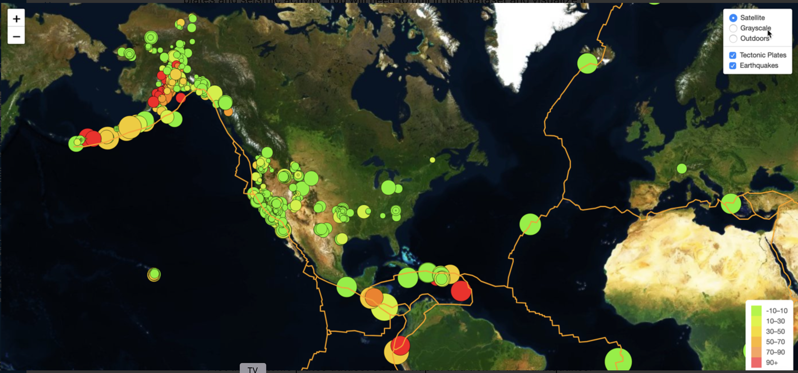

# leaflet-challenge

## Background

Welcome to the United States Geological Survey, or USGS for short! The USGS is responsible for providing scientific data about natural hazards, the health of our ecosystems and environment; and the impacts of climate and land-use change. Their scientists develop new methods and tools to supply timely, relevant, and useful information about the Earth and its processes. 

They collect a massive amount of data from all over the world each day, but they lack a meaningful way of displaying it. Their hope is that being able to visualize their data will allow them to better educate the public and other government organizations on issues facing our planet.

The USGS provides earthquake data in a number of different formats, updated every 5 minutes. Available at [USGS GeoJSON Feed](http://earthquake.usgs.gov/earthquakes/feed/v1.0/geojson.php), I chose a GeoJSON file to help  visualize **All Earthquakes from the past 7 Days**. 

**The visualization can be seen here: [Earthquake Visualization](https://scbigler.github.io/leaflet-challenge/)**

### Notes
* A `static` folder contain custom CSS, images, and a `config.js` file which holds the MapBox API key that will need to be entered. This is required to be able to view the visualization.
* A `Leaflet-Step-1` folder contains the `logic.js` file for the basic visualization.
* A `Leaflet-Step-2` folder contains the `advanced.js` and `index.html` files for the advanced visualization.
* The root folder contains the basic visualization `index.html`.

### Level 1: Basic Visualization

After importing the data using d3, the following steps were followed:

* Create a map using Leaflet that plots all of the earthquakes from your data set based on their longitude and latitude.

* The data markers reflect the magnitude of the earthquake in their size and color. Earthquakes with higher magnitudes appear larger and darker in color.

* Include popups that provide additional information about the earthquake when a marker is clicked.

* Create a legend that will provide context for map data.

### Level 2: More Data (Optional)

Additionally, using [tectonic plate data](https://github.com/fraxen/tectonicplates), the bonus section was completed as below:

* Plot a second data set on the map.

* Add a number of base maps to choose from as well as separate out our two different data sets into overlays that can be turned on and off independently.

* Add layer controls to the map.

* Add buttons to both Level-1 and Level-2 maps to navigate between the basic and advanced visualizations.

